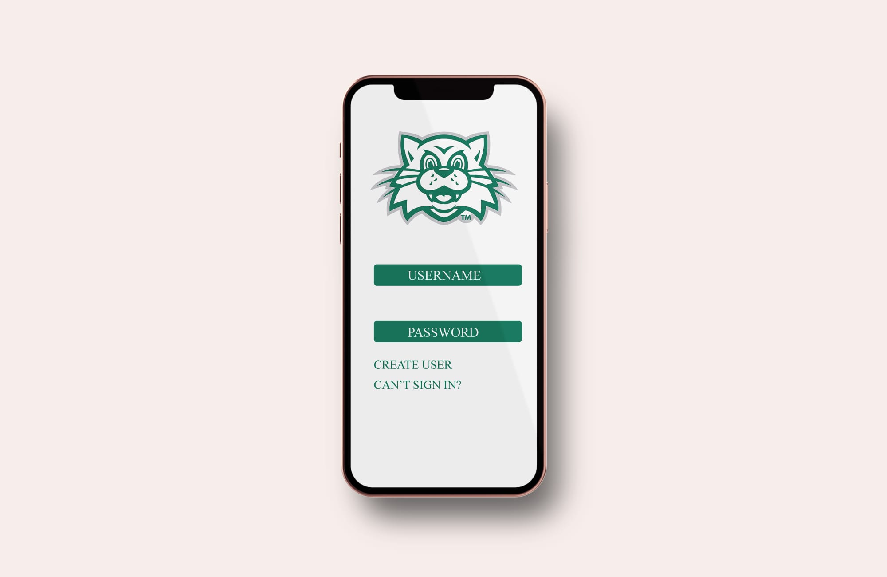
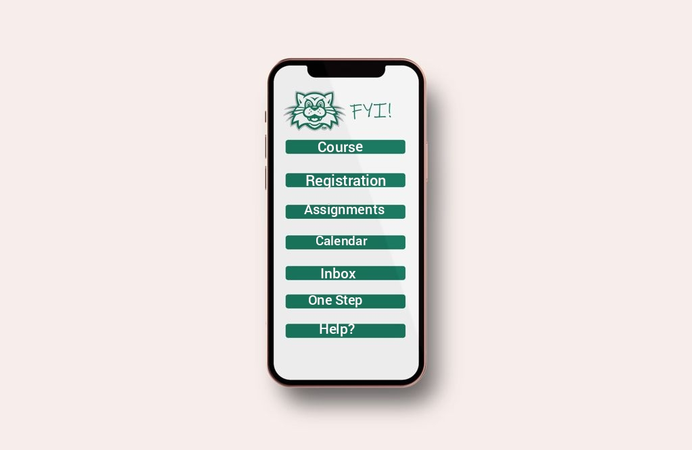
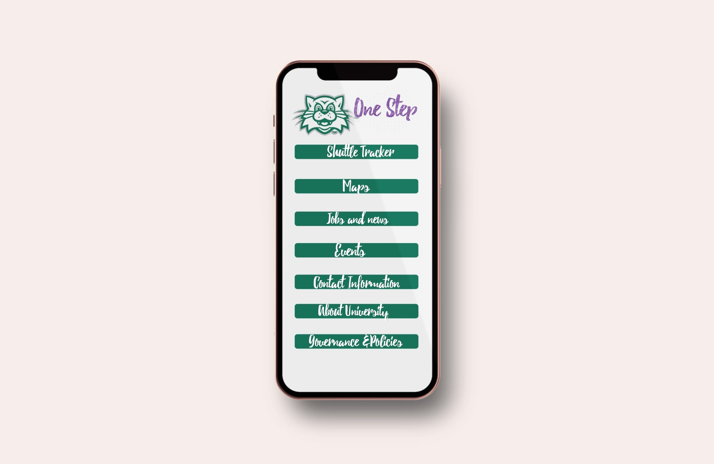
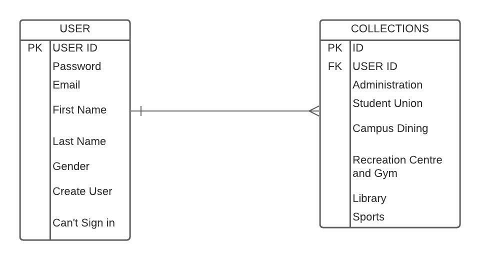

# 691-01-F21-RFP-Group3
BEARCAT BUDDY

## RFP - Bearcat Buddy

### Statement Of Purpose
Creating a Web based system for convenience of class tasks where user can manage their:
1. Registration of classes for certain terms.
2. Helps to know about the upcoming events.
3. Contact information of faculty like their emails and their availability times in office .
4. Allows students to came to know about administrative office hours.
5. About university history and importance of courses.
6. Course outcomes and program outcomes .
7. Can easily find course materials of certain courses under modules option.
8. Also visit their syllabus under syllabus option.
9. To-do list like what need to be do on specific day.
10. And easily visit their grades on view grades option.
11. Resent feedback for submitted assignments.

### Vision: 
Bearcat Study Buddy is a mobile application that is designed to act as one destination for all the faculty members and students at the university. As stated above, the main aim of the app is to make users' life simple by providing all the features required for students and faculty members on a single platform. Some of the features which are going to be achieved in this app are stated below:
- Managing the academics of the students which includes the course registration and management.
- Messaging framework, to communicate with faculty and student members.
- Includes a One-Stop feature which incorporates various subcategories such as university map, events, jobs and news in university, contact information, etc.

### Functional Requirements:
Create a progressive web app (or native application) with authentication and authorization. The following roles are suggested:
1. Adminstrator (access to all the information including app settings)
2. Faculty (ingress to the course related details)
3. User (access to their content)
To our Bearcat Study Buddy application, we have a login page which will direct the user to the home page of the application, where the user can subject to individual category according to the requirement of their own area of knowledge.

As a user, one needs to create an account:
1.	The user must create an account with the credentials given by the universities.
2.	After creating an account, one would get the User Id and Password with which the user can login into the page.
3.	If at all, the user can’t login due to technical issues or forgets the Password, the user can again reset the credentials by using their e-mail’s.
4.	 However, if the user isn’t a student or doesn’t belong to the University, they can add their accounts by purchasing the application and use for their personal use.

After logging-in, the user can direct himself to the following sections:
- REGISTRATION
- COURSES
- ASSIGNMENTS
- INBOX
- CALENDER
- ONE STOP
- HELP?

As a user, one can access the REGISTRATION column, where he can find the following:
1.	One can look to register their courses in their available slot timings.
2.	In scenarios like, when the student isn’t comfortable with the course or with their class timings, one can add or drop the class according to their comfort.
As a user, one can access the REGISTRATION column, where he can find the following:
3.	One can look to register their courses in their available slot timings.
4.	In scenarios like, when the student isn’t comfortable with the course or with their class timings, one can add or drop the class according to their comfort.

As a user, one can access to COURSES for the following:
1.	The user can look up to the available courses for that particular semester.
2.	User has the option to opt extra courses which are not in their semester in order to gain additional knowledge for their project work.
3.	User can customize their dashboard with their courses.

As a user, one can access the ASSIGNMENTS, for the following:
1.	User can download their assignments and finish them and submit according to the deadlines.
2.	Students can also download their old assignments so that they can prepare for the exam.
3.	If the submission is wrong, user can re-submit their assignments.
4.	User can see the upcoming assignments according to the earliest deadlines.
5.	User can also see the undated assignments so that they cope up with the study work.

As a user, INBOX is used for:
1.	User can message the faculty if they have any doubts regarding the subject.
2.	User receives mails from professors if they want to intimate any information.

As a user, CALENDER is created for:
1.	They get notified of all the assignments for that week/month.
2.	User can highlight with unique colors for each subject not to get confused.
3.	Assignments gets strike off when submitted.

As a user, one can access to ONE-STOP, which is one of the important features of the application for the following information:
1.	User can look into the shuttle tracker, where one can book their safe rides and know the availability of free rides provided by the university. Maps enables the user to know their location and about the directions to all the buildings of the university with clear mapping and also about the details of that particular building.
2.	User can look for Jobs and apply them, both on-campus employment and for internships.
3.	One can also get the updates and news about the university and about world news and technology around.
4.	User can know about the recreational events happening in the university and depending on their interests they can attend them.
5.	User can access the contact information of the campus buildings and respective faculty and peer-mates email ids.
6.	User can go-to About University, for knowing the history or the total occupancy of students or fee structures of the university.
7.	Governance & Policy will let the users know the rules and regulations of the students part-time employment policies, fee installments policies, attendance and plagiarism of assignments & their consequences.

As a user, HELP :
1.	User can report a problem if bearcat study buddy misbehaves.
2.	User can live chat with bearcat support.
3.	User has the hotline number to contact immediately.

Expected entites may include:

*User*
- User id
- email
- password
- First Name
- Last Name
- Date last accessed

*Collections*
- Collection ID
- User id
- Courses
- Registration
- Inbox

### Layout:

   Login Page View

   Dashboard View

   Menu View

### ER Diagram:

   BearCats Buddy ER Diagram

